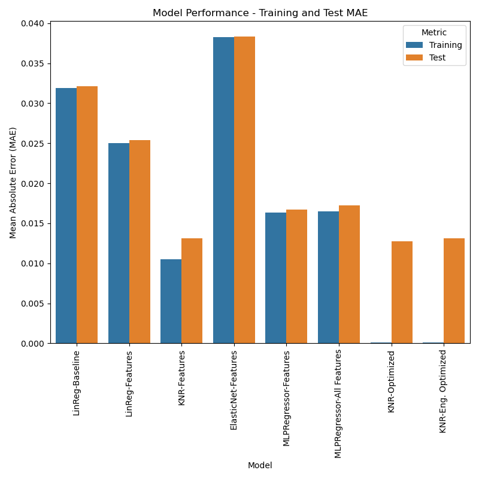

# Business Objective
Earthquakes around the world cause significant damage to property and loss of lives. The objective of this project is, for a given location, predicting how much damage a structure sustain for a nearby earthquake scenario. We will use Peak Ground Acceleration (PGA) as a metric to approximate damage as these two are very closely correlated.

Before making investment in buildings and critical infrastructure, earthquake risk should be assessed for the particular area to minimize loss in the event of an earthquake. Otherwise, investments can be lost in a catastrophic earthquake event. This model can be used by public authorities prior to providing permits for a building or by private entities before making investment decisions. Also it can be utilized by insurance companies to asses risk.

# Data Understanding
Dataset comes from Pacific Earthquake Engineering Research Center. https://apps.peer.berkeley.edu/ngawest/nga_flatfiles.html

Dataset includes seismograph measurements of 600 earhquakes around the world, from 1935 to 2011. Each earthquake is measured by multiple stations. In total there are 21539 measurements in the dataset.

Each measurement has 274 columns. Because of the high number of columns, we will only summarize columns are potentially useful for analysis.

- Record Sequence Number: Unique identifier for each record in the dataset
- EQID: ID if the earthquake
- Earthquake Name: Name of the earthquake
- YEAR: Year of the earthquake
- MODY: Month and day of the earthqyake
- Station Name: Short name of the station measuring the earthquake
- Earthquake Magnitude: Magnitude of the earquake in Richter scale
- Vs30 (m/s) selected for analysis: Vs30 of the ground implying the material type. Speed of the wave at 30meters depth.
- PGA (g): Peak ground acceleration. This is used as the target variable
- Strike (deg): Direction of the fault relative to North
- Dip (deg): Angle of the fault relative to horizontal
- Rake Angle (deg): Direction of fault motion with respect to the strike
- Hypocenter Latitude (deg)
- Hypocenter Longitude (deg)
- Hypocenter Depth (km): Depth of the earthquake at hypocenter
- Depth to Top Of Fault Rupture Model: Distance from the surface to the rupture plane
- Fault Rupture Width (km): Width of the rupture
- Fault Rupture Area (km^2): Area of the rupture
- EpiD (km)': Distance to epicenter
- HypD (km)': Distance to hypocenter
- ClstD (km): Closest distance between site to the rupture
- Vs30 (m/s) selected for analysis': Shear wave velocity at 30 meters of the soil
- Station Latitude
- Station Longitude'
- PGA (g)': Peak ground acceleration. This is the target variable that predicts magnitude of the shake at a given location

# Data Preperation

# Modeling

## Evaluation Metrics

## Baseline Model

## Feature Selection

## Alternative Models and Optimization

# Evaluation

# Results
Using historical earthquake data, risk factors for a given location can be relatively accurately estimated. K-Neighgbor Regressor algorithm provides the best accuracy for this purpose.

  

The accuracy of results depend on the location. For San Francisco Bay area, the model results are more accurate than Los Angeles area.

  

Similarly Soutern Japan is more accurate than Northern Japan. These variances could be related to local geological features such as basin effect.

  

Results are more accurate for smaller earthquakes and for locations that are further away from the epicenter. This is a disadvantage of the model as, larger earthquakes and locations closer to the epicenter tend to be effected more than others.

Overall, the results of the study are encouraging and can be quite useful assessing earthquake risk at a given location and earthquake scenario.

Detailed jupyter notebook of the technical analysis can be found here: https://github.com/bilgeozcay/earthquake/blob/main/analysis.ipynb

# Next Steps
Although K-Neightbor Regressor performed better, Neural Network was the second best model with no tuning. Neural Network hyper-parameters can be optimized and there is a potential to get more accuracy as a result.

As an enhancement to the model, features capturing local factors should be explored. Those features may improve the efficiency for certain locations such as Los Angeles and Northern Japan.

Impact of large earthquakes in relatively closer locations to the epicenter could be seperately evaluated. Such model may capture majority of earthquake losses more accurately. 
