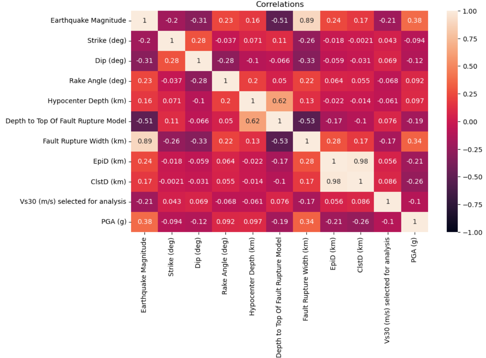

# Business Objective
Earthquakes around the world cause significant damage to property and loss of lives. The objective of this project is, for a given location, predicting how much damage a structure sustains for a nearby earthquake scenario. We will use Peak Ground Acceleration (PGA) as a metric to approximate damage as these two are very closely correlated.

Before making investment in buildings and critical infrastructure, earthquake risk should be assessed for the particular area to minimize loss in the event of an earthquake. Otherwise, investments can be lost in a catastrophic earthquake event. These types of models can be used by public authorities prior to providing permits for a building or by private entities before making investment decisions. Also it can be utilized by insurance companies to asses risk.

# Data Understanding
Dataset comes from Pacific Earthquake Engineering Research Center. https://apps.peer.berkeley.edu/ngawest/nga_flatfiles.html

Dataset includes seismograph measurements of 600 earhquakes around the world, from 1935 to 2011. Each earthquake is measured by multiple stations. In total there are 21539 measurements in the dataset.

Each measurement has 274 columns. Because of the high number of columns, we will only summarize columns are potentially useful for analysis.

- Record Sequence Number: Unique identifier for each record in the dataset
- EQID: ID if the earthquake
- Earthquake Name: Name of the earthquake
- YEAR: Year of the earthquake
- MODY: Month and day of the earthqyake
- Station Name: Short name of the station measuring the earthquake
- Earthquake Magnitude: Magnitude of the earquake in Richter scale
- Vs30 (m/s) selected for analysis: Vs30 of the ground implying the material type. Speed of the wave at 30meters depth.
- PGA (g): Peak ground acceleration. This is used as the target variable
- Strike (deg): Direction of the fault relative to North
- Dip (deg): Angle of the fault relative to horizontal
- Rake Angle (deg): Direction of fault motion with respect to the strike
- Hypocenter Latitude (deg): Latitude of hypocenter
- Hypocenter Longitude (deg): Longiture of hypocenter
- Hypocenter Depth (km): Depth of the earthquake at hypocenter
- Depth to Top Of Fault Rupture Model: Distance from the surface to the rupture plane
- Fault Rupture Width (km): Width of the rupture
- Fault Rupture Area (km^2): Area of the rupture
- EpiD (km): Distance to epicenter
- HypD (km): Distance to hypocenter
- ClstD (km): Closest distance between site to the rupture
- Vs30 (m/s) selected for analysis': Shear wave velocity at 30 meters of the soil
- Station Latitude: Latitude of the station
- Station Longitude: Longtitude of the station
- PGA (g)': Peak ground acceleration. This is the target variable that predicts magnitude of the shake at a given location

## Data Distribution
Data encomposses a wide variety of earthquake magnitudes from 3 to 8. This is quite useful as we can find models that predict PGA for small or large earthquakes.

  

In terms of PGA, data is heavily skewed towards lower values. This is a disadvantege of any earthquake dataset, as smaller magnitude earthquakes are much more frequent than larger ones. Also PGA quickly drops as moved away from the epicenter.

  

The distribution of the distance from the epicenter is concentrated around <400km. This is ideal as earthquakes rarely cause structural damage beyond that radius.

  

Finally data set covers a wide range of VS30 values. VS30 correlates with the type of the gound material (sand, soil, rock, etc) and can be used as a factor in predicting ground shaking.

  

## Relationships Between Features
PGA drops quickly moving away from the Epicenter, as expected.

  

Logarithmic scale captures the relationship much better as seen below. Each magnitude clearly creates some bands in terms of how logarithm of PGA varies with the logarithm of distance to epicenter.

  

Correlations between the variables show positive correlation between PGA and Earthquake Magnitude, Fault Rupture Width. There is negative correlation between Depth of the Fault Rupture, Distance to Epicenter. These relationships are as expected.

  

# Data Preperation
Based on the findings, a total of 17 variables are selected for modeling. These variables are as follows:
- Earthquake Magnitude
- Strike (deg)
- Dip (deg)
- Rake Angle (deg)
- Hypocenter Latitude (deg)
- Hypocenter Longitude (deg)
- Hypocenter Depth (km)
- Depth to Top Of Fault Rupture Model
- Fault Rupture Width (km)
- Fault Rupture Area (km^2)
- EpiD (km)
- HypD (km)
- ClstD (km)
- Vs30 (m/s) selected for analysis
- Station Latitude
- Station Longitude
- PGA (g)

Since all variables are continuous variables, no encoding is necessary. However standard scaler is applied to all data before feeding to each model, as a best practice.

To capture the logaritmic relationships, log versions are added for the following variables:
- EpiD (km)
- HypD (km)
- ClstD (km)
- Vs30 (m/s) selected for analysis

Any row with a missing column in eliminated from the dataset to ensure regression models can be fed.

Data was split into training and test datasets, to ensure error is measured seperately for those and models are not overfitting. 80% training and 20% test split was used.

# Modeling
A total of 4 different model types are run:
- Linear Regression (LinearRegression)
- K-Neareast Neighbor Regression (KNR)
- Elastic Net (ElasticNet)
- Neural Networks - Multi-layer Perceptron Regressor (MLPRegressor)

For each model, various feature combinations and hyperparapeters are explored. In total, modeling was done in 8 iterations.

## Evaluation Metrics
As the performance metric, Mean Absolute Error (MAE) was used on training and test datasets. We use absolute error, because it is easier to interpret the metric to assess the impact on a structure. An absolute error of 0.1 is insignificant for a given data point, whereas an absolute error of 1 will make 1g difference in terms of acceleration exerted on a structure.

The scatter plot comparing actual PGA and precited PGA was used as a suplementary visualization.

## Baseline Model
Linear Regression was used as a Baseline model with 3 variables:
- Earthquake Magnitude
- EpiD (km)
- Vs30 (m/s) selected for analysis

MAE for training and test datasets were measured as 0.031 and 0.032.
Plotting actual and predicted PGA values shows that, model did not accurately predict PGAs greater than 0.2.

  

## Feature Selection
Bacause of the high number of variables, L1 regularization (Lasso) was utilized for feature selection. L1 regularization indicates that following are the relative value of the variables.

  

For the models, any feature greater than 0.02 as L1 coefficient was used for analysis. These features are:
- Earthquake Magnitude
- Hypocenter Latitude (deg)
- EpiD (km)
- ClstD (km)
- Station Latitude
- EpiD (km) - Log
- HypD (km) - Log
- ClstD (km) - Log

## Alternative Models and Optimization
7 additional models were run:
1. Linear Regression based on features selected by L1 regularization -> LinReg-Features
2. K-Nearest Neighbor Regressor based on features selected by L1 regularization, without hyper-parameter tuning -> KNR-Features
3. Elastic Net based on features selected by L1 regularization -> ElasticNet-Features
4. Neural Network with 3 hidden layer sizes of 10, 100, 100 and based on features selected by L1 regularization -> MLPRegressor-Features
5. Neural Network with all 21 columns (including log scale variables) -> MLPRegressor-All Features
6. K-Nearest Neighbor Regressor based on features selected by L1 regularization, with Grid Search hyper-parameter tuning -> KNR-Optimized
7. K-Nearest Neighbor Regressor based on expert selected features, with Grid Search hyper-parameter tuning -> KNR=Eng. Optimized. For this model, an expert was consulted to give opinion on best features to use.

# Evaluation

The training and test error of each iteration is summarized below.

|Model|Training MAE|Test MAE|
|-----|------------|--------|
|LinReg-Baseline|0.031933|0.032136|
|LinReg-Features|0.025045|0.025390|
|KNR-Features|0.010536|0.013157|
|ElasticNet-Features|0.038280|0.038344|
|MLPRegressor-Features|0.017873|0.017622|
|MLPRegressor-All Features|0.017305|0.017908|
|KNR-Optimized|0.000097|0.012715|
|KNR-Eng. Optimized|0.000091|0.013122|

In terms of training data set, K-Nearest Neighbor Regressor with expert inputs, optimized by grid search performed the best.
Second best model was K-Nearest Neighbor Regressor with features selected by the L1 regularization.
In terms of test data set K-Nearest Neighbor Regressor was the best performer as well.

In summary, K-Nearest Neighbor Regressor seems to be the best fit for this exercise.

K-Nearest Neighbor Regressor with expert inputs greatly improve the results compared to the baseline model.

  

# Results
Using historical earthquake data, risk factors for a given location can be relatively accurately estimated. K-Neighgbor Regressor algorithm provides the best accuracy for this purpose.

  

The accuracy of results depends on the location. For San Francisco Bay area, the model results are more accurate than Los Angeles area.

  

Similarly Southern Japan is more accurate than Northern Japan. These variances could be related to local geological features such as basin effect.

  

Results are more accurate for smaller earthquakes and for locations that are further away from the epicenter. This is a disadvantage of the model as, larger earthquakes and locations closer to the epicenter tend to be effected more than others.

Overall, the results of the study are encouraging and can be quite useful assessing earthquake risk at a given location and earthquake scenario.

Detailed jupyter notebook of the technical analysis can be found here: https://github.com/bilgeozcay/earthquake/blob/main/analysis.ipynb

# Next Steps
Although K-Neightbor Regressor performed better, Neural Network was the second best model with no tuning. Neural Network hyper-parameters can be optimized and there is a potential to get more accuracy as a result.

As an enhancement to the model, features capturing local factors should be explored. Those features may improve the efficiency for certain locations such as Los Angeles and Northern Japan.

Impact of large earthquakes in relatively closer locations to the epicenter could be seperately evaluated. Such model may capture majority of earthquake losses more accurately. 
